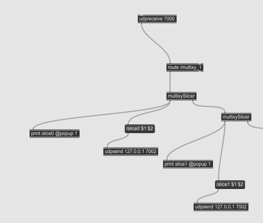
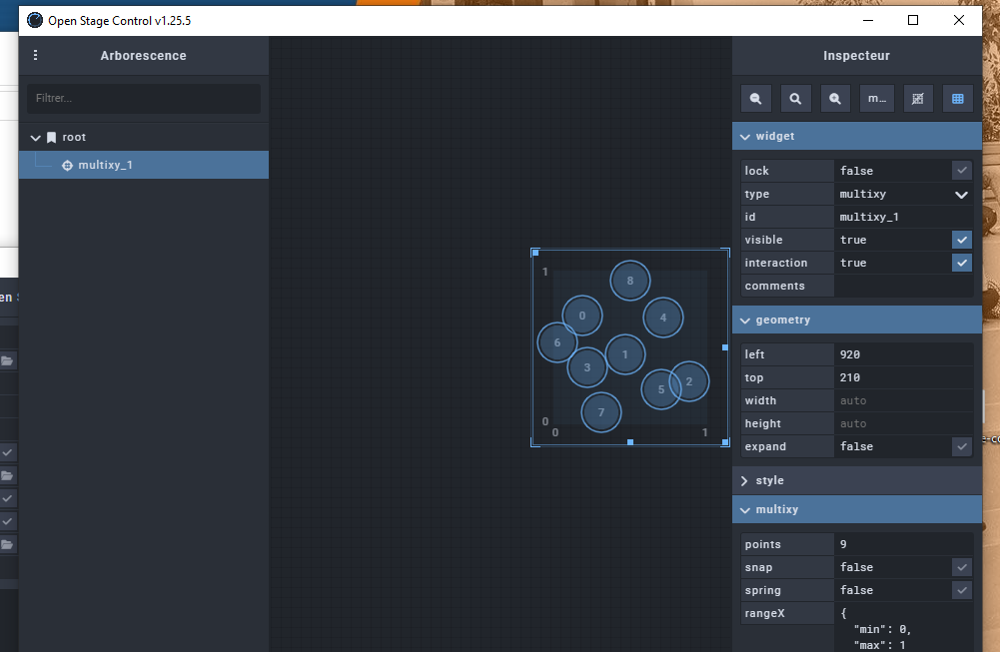
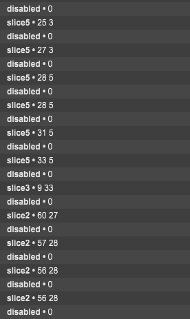

# Prototype Unity
Prototype de l'interaction du prototype (Max et Open Stage Control) à Jacob avec Unity

## Le projet général
Ceci est le prototype du *module* Unity de la table intéractive. C'est-à-dire que ce prototype contrôle la scène Unity à partir de la position des statuettes (fiducials) détecté.

## Ce prototype
Le but de ce prototype est de vérifier que on peut contrôler une scène Unity et ses éléments à partir de Max et OSC. 

## La méthodologie
À partir du code OSC-Unity qu'on a utilisé dans le cours de Thomas et du patcher prototype de Jacob, j'ai fais en sorte que le Open Stage Control envois des données OSC au patcher Max qui traite ceux-ci et envois des données OSC plus précise à Unity, qui change les coordonnées des boules avec des particules.

### Patcher Max
##### Spaghetti

### Open Stage Control

### Console Max
##### Quelle "Statuette" est contrôlé et ses coordonnées dans Open Stage Control de 0 à 100 dans les deux axes

## Résumé des résultats
https://github.com/Les-gars-d-la-table/unity-prototype/assets/74332549/caa6a970-da34-4d01-8f23-4b29001b4764

## Conclusion
Le prototype confirme qu'on peux contrôler une scène Unity à partir de Max et Open Stage Control. La seule chose que j'ai remarqué est que je ne suis pas sûr si il est possible de changer l'orientation des boules dans Unity. 

